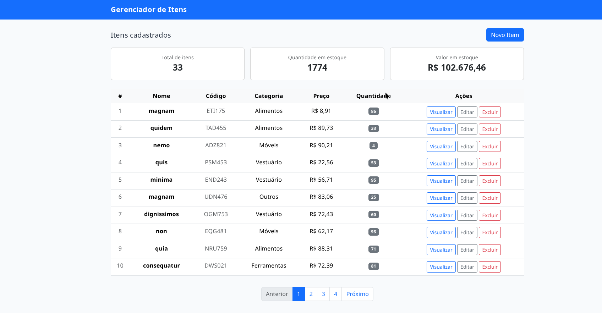

#  Gerenciador de Itens 



Este projeto é uma aplicação de gerenciamento de tarefas desenvolvida com Laravel (frontend via Vue.js), com ambiente configurado via Docker.

## 📋 Sobre o Projeto

Este é um sistema de gerenciamento de itens que permite criar, visualizar, editar e excluir produtos em estoque. O projeto foi desenvolvido seguindo as melhores práticas de desenvolvimento, com arquitetura em camadas
Service Layer Pattern, validações e interface responsiva.
 
### Funcionalidades

- CRUD completo de itens (Criar, Listar, Visualizar, Editar, Deletar)
- Dashboard com resumo de estoque (total de itens, quantidade e valor total)
- Modal de visualização detalhada de itens
- Paginação automática (10 itens por página)
- Sistema de categorias predefinidas
- Validação de dados no backend com FormRequest
- Interface moderna e responsiva com Bootstrap 5
- Testes automatizados
- Totalmente containerizado com Docker

## 🛠️ Tecnologias Utilizadas

### Backend
- **PHP 8.3** - Linguagem de programação
- **Laravel 13** - Framework PHP
- **MySQL** - Banco de dados (via migrations)
- **Trait** - 
- **PHPUnit** - Testes automatizados

### Frontend
- **Vue.js 3** - Framework JavaScript reativo
- **Vite** - Build tool e dev server
- **Axios** - Cliente HTTP para consumir a API
- **Bootstrap 5** - Framework CSS para estilização
- **SweetAlert2** - Alertas e modais elegantes

### Infraestrutura
- **Docker** - Containerização
- **Docker Compose** - Orquestração de containers
- **Nginx** - Servidor web
- **PHP-FPM** - FastCGI Process Manager

### Ferramentas de Desenvolvimento
- **Faker** - Geração de dados fake para testes
- **Make** - Automação de comandos


### Padrões e Práticas Utilizadas

- **Service Layer Pattern** - Lógica de negócio separada dos controllers
- **Repository Pattern** (via Eloquent ORM)
- **Form Request** - Validação centralizada e reutilizável
- **Trait** - Respostas padronizadas da API
- **Factory Pattern** - Geração de dados para testes e seeds


## 🚀 Como Rodar o Projeto

### 1. Clone o Repositório

```bash
git clone https://github.com/martinss08/CRUD.git
cd laradocker
```

### 2. Execute o Setup Completo

O projeto possui um Makefile que automatiza todo o processo de instalação:

```bash
make setup
```

Este comando irá:
1. Subir os containers Docker (app + nginx)
2. Instalar as dependências do Composer
3. Gerar a chave da aplicação Laravel
4. Executar as migrations e seeders (criar banco e popular com dados)
5. Instalar dependências do frontend e iniciar o servidor Vite

### 3. Acesse a Aplicação

Após o setup, você terá dois serviços rodando:

- **Frontend (Vue.js)**: http://localhost:5173
- **API (Laravel)**: http://localhost:8080/api

Abra o navegador e acesse: **http://localhost:5173**

## 🐞 Comandos úteis

O projeto possui os seguintes comandos Make para facilitar o desenvolvimento:

| Ação                          | Comando                                                  |
|-------------------------------|----------------------------------------------------------|
| Subir containers              | `make setup`                                             |
| Iniciar o frontend            | `make frontend`                                          | 
| Executar os seeders           | `make seed`                                              | 
| Rodar os testes               | `make test`                                              | 
| Parar containers              | `make down`                                              |


### Comandos Docker Diretos

Se precisar executar comandos diretamente no container:

```bash
# Acessar o container da aplicação
docker exec -it laradocker_app bash

# Executar comandos Artisan
docker exec -it laradocker_app php artisan migrate
docker exec -it laradocker_app php artisan db:seed

# Executar Tinker
docker exec -it laradocker_app php artisan tinker

# Ver logs
docker logs laradocker_app
docker logs laradocker_nginx
```

##  API Endpoints

### Items

| Método |       Endpoint      |                   Descrição                 |
|--------|-------------------- |---------------------------------------------|
| GET    | `/api/items`        | Lista todos os itens (paginado)             |
| GET    | `/api/items?page=2` | Lista itens da página 2                     |
| GET    | `/api/items/{id}`   | Exibe um item específico                    |
| POST   | `/api/items`        | Cria um novo item | JSON com dados do item  |
| PUT    | `/api/items/{id}`   | Atualiza um item | JSON com dados do item   |
| DELETE | `/api/items/{id}`   | Deleta um item                              |


### Categorias Válidas

- Eletrônicos
- Alimentos
- Vestuário
- Móveis
- Livros
- Brinquedos
- Ferramentas
- Outros


## 🧪 Testes

O projeto possui testes automatizados para garantir a qualidade do código:

Os testes cobrem:
- ✅ CRUD completo de itens
- ✅ Validações de campos obrigatórios
- ✅ Validações de formato de dados
- ✅ Unicidade de código
- ✅ Testes de paginação


### Backend (ItemRequest.php)

- **name**: obrigatório, string, mínimo 3 caracteres, máximo 255
- **code**: opcional, string, máximo 50 caracteres, único
- **category**: opcional, string, deve ser uma das categorias válidas
- **description**: opcional, string
- **price**: obrigatório, numérico, mínimo 0
- **quantity**: obrigatório, inteiro, mínimo 0

Todas as validações retornam mensagens personalizadas em português.

### Frontend (ItemManager.vue)

- Validação de campos obrigatórios
- Exibição de erros de validação do backend
- Conversão correta de tipos (parseFloat, parseInt)


